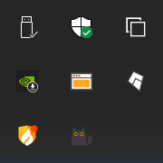
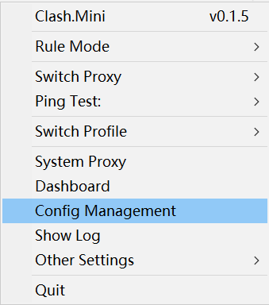
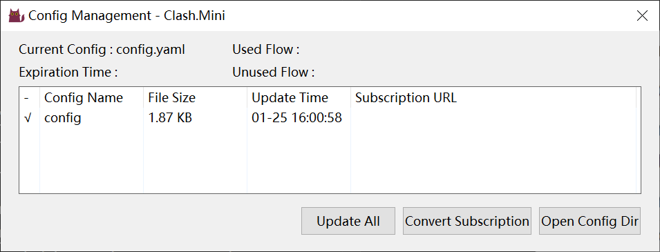
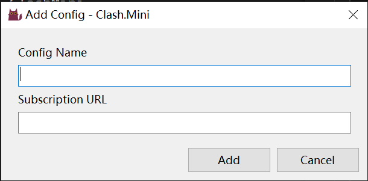
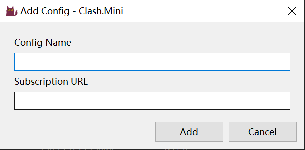

<h1 align="center">
  
   Clash.Mini 
</h1>

<h4 align="center">A simple GUI for Clash.</h4>

 

## Why this repo

Provide a simple GUI for [clash](https://github.com/Dreamacro/clash) on windows platform.

Based on project TrayedClash by imgk

## Features
* Simple GUI written by Golang only
* Integrated core

## Usage
### Subscription
1. Find icon of the bottom-right windows

2. Right click the icon of ClashMini and a option dialog occurs

3. Click the Config Management, then jump a application window named Config Management

4. Right click in the table you've seen, and select the "Add Config"

5. edit the  config name and the URL of subscription, Click Add button and Update All button.
## Discussions
- [Telegram](https://t.me/MetaKernel)
- [Telegram Channel](https://t.me/ClashMiniNo1)

## Credits
- [Clash](https://github.com/Dreamacro/clash)
- [Clash.Net](https://github.com/ClashDotNetFramework/ClashDotNetFramework)
- [TrayedClash](https://github.com/imgk/TrayedClash)
- [Yacd](https://github.com/haishanh/yacd)

